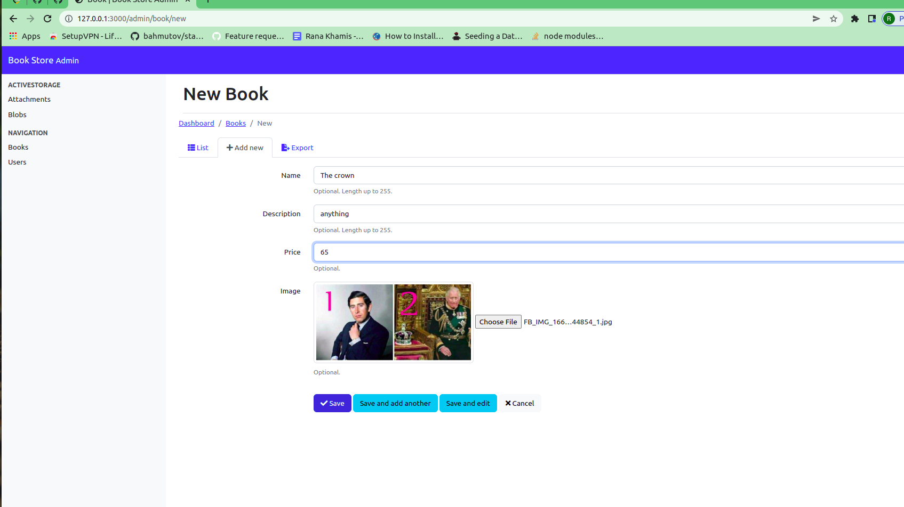
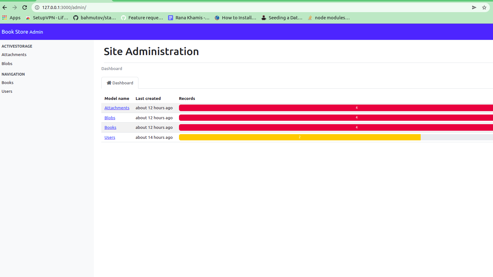
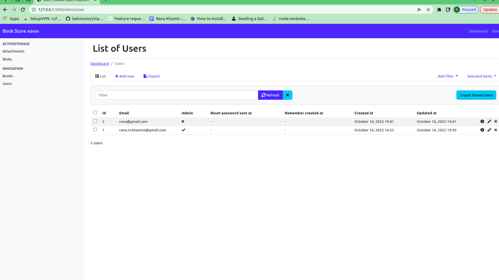
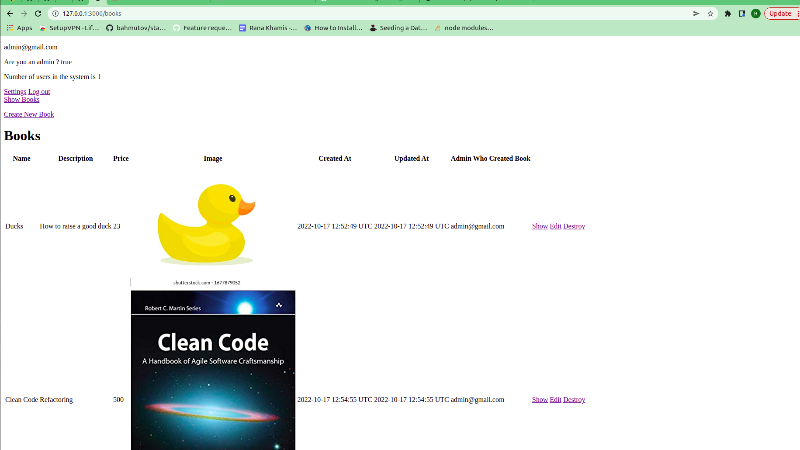
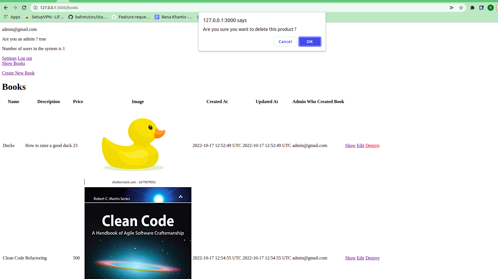
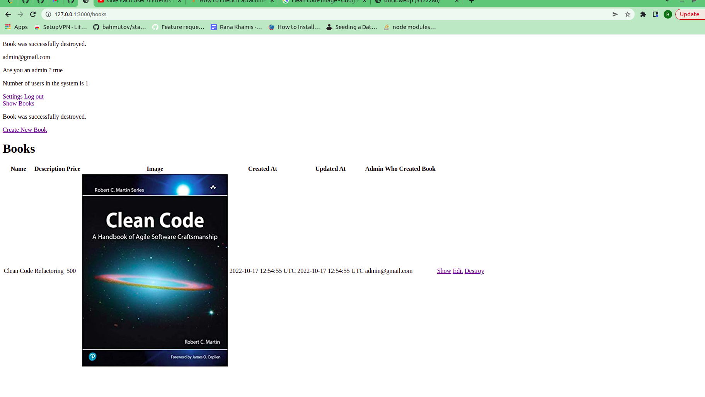
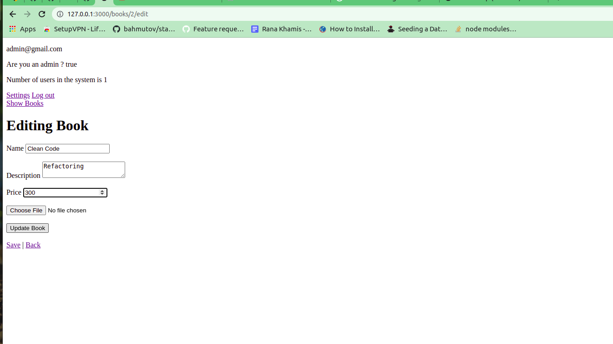
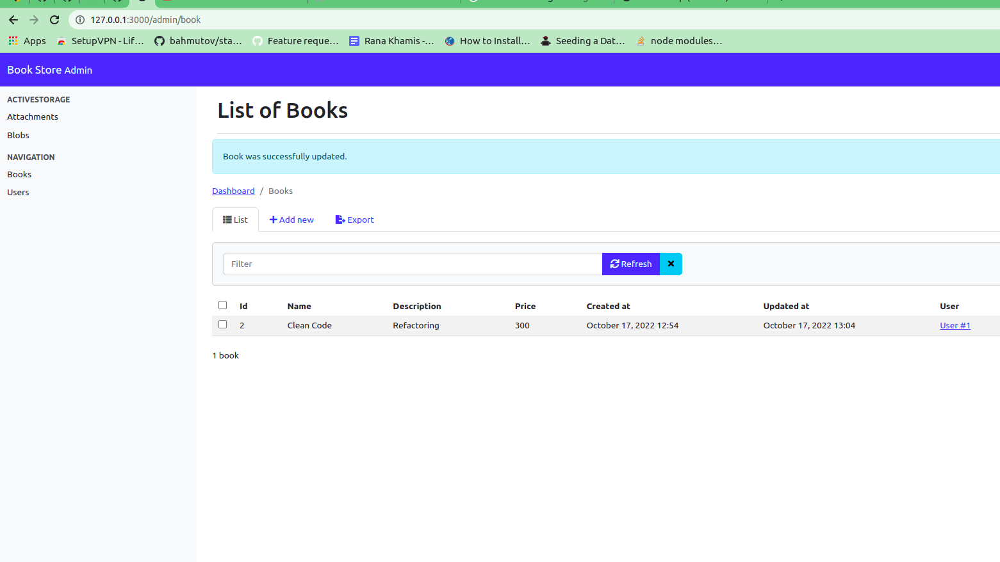
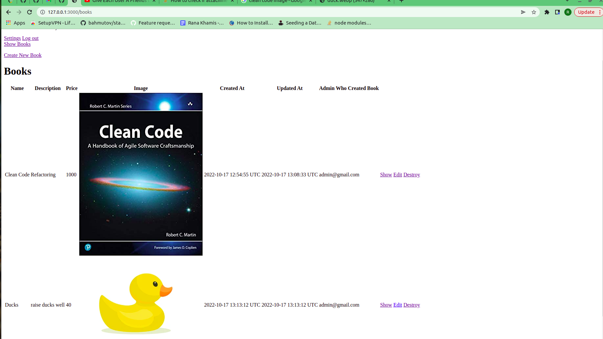
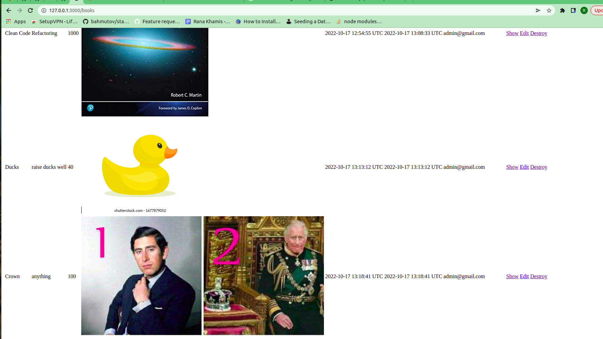

# README
  
* System dependencies:  
* Ruby version => 2.6.1
* Rails version => 6.0.6

# Note that this is a backend project so I didn't work UI design much

## Download the project and run the following :  
  
  1- bundle install  
  2-you would need to cange mysql password to yours  
  3- rails db:drop  
  4- rails db:create  
  5- rails db:migrate  
  6- rails db:seed  
  7- run " rails s " command 
  

# This is a book store the covers the following functionalities:
## Note that I gave you the normal view for the admin panel and another view using the gem because it wasn't a bit clear in the document

1-Admin panel  => you can redirect to http://127.0.0.1:3000/admin/book  after signing in for a better view  
2- User/admin authentication and roles  
3- Admin pages show him all the books with their name, image, description, price, created_at and updated_at and name of the admin who created this product  

4- Admin can delete a product with a modal of " Are you sure you want to delete this product? " popup  
5- Admin can update name, image, description, price of the product in the edit page and wether save it or go back and discard  
6- Admin can show product from the button that will redirect him to the show page with all the products in admin panel  
7- Admin can create a new product (book)  

# In this section you can find pictures for the 7 requirements

## First Requirement:

  

  

  

## Second Requirement:

  

## Third Requirement:  

  

## Fourth Requirement:  

  
  

## Fifth Requirement:  
 
   
   

## Sixth Requirement:  

  

  

## Seventh Requirement:  

  
  

